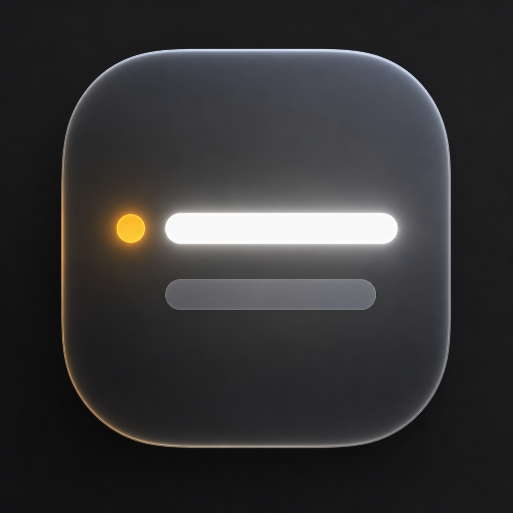
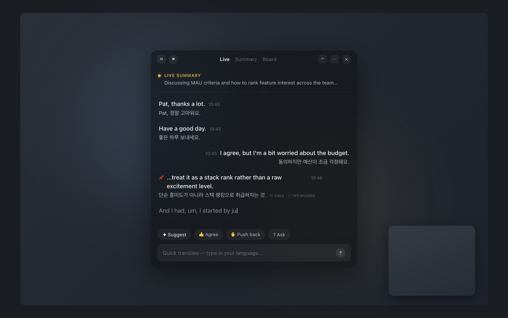
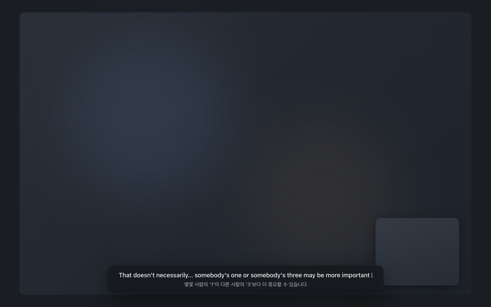

<div align="center">



# LiveCap

### Live captions and translation for everything you hear. Local-first, on your own AI.

<p>
  <a href="#-quick-start"><strong>Quick Start</strong></a> ·
  <a href="#-how-it-works"><strong>How it Works</strong></a> ·
  <a href="#-the-engine-is-yours"><strong>Bring Your Own AI</strong></a> ·
  <a href="#-privacy"><strong>Privacy</strong></a> ·
  <a href="#-credits"><strong>Credits</strong></a>
</p>

<p>
  
  
  
  
  <a href="LICENSE"></a>
</p>



</div>

---

> **Status: pre-MVP, building in public.** The design package and full product spec are in this repo ([docs/PROPOSAL.md](docs/PROPOSAL.md), [design/](design/README.md)); the roadmap lives in the [MVP epic](../../issues/1). Star the repo to follow along.

## What is LiveCap?

You're in a meeting, a webinar, or a call that isn't in your first language. LiveCap is a small pane of glass that floats beside it:

- It **hears both sides** — system audio (them) and your microphone (you) — and shows live captions in whatever language is being spoken, detected automatically.
- Under every sentence, it shows a **translation into your language**, half a beat later.
- A one-line **live summary** keeps you oriented; when the meeting ends, a clean **Markdown transcript is already saved** to a local folder.
- And when you need to speak up, **reply suggestions** and a **quick-translate box** give you the words.

Speech never leaves your machine: transcription is on-device Whisper. Translation runs on **AI you already have** — the Claude or Codex CLI installed on your Mac, or a bundled local model. No new subscription, no API key setup, no cloud account.

## ✦ Why LiveCap?

Every existing option makes you choose: cloud captioning services that stream your meetings to someone else's servers, OS captions locked to one platform and English, or meeting bots that visibly join your call as a participant. LiveCap is none of those — it's a private overlay only you can see (it's even excluded from screen sharing), it translates between real language pairs, and it works with any app that makes sound: Zoom, Meet, YouTube, a podcast, a person in the room.

## ─ How it Works

```
┌─ system audio ─┐                                    ┌─ caption (instant)
│                ├─► VAD ─► Whisper (on-device) ──────┤
└─ microphone ───┘              │                     └─ translation (~1s later)
                                │ finalized sentences
                                ▼
                   Translation engine (yours — see below)
                                │
                ├─ live summary · meeting board · reply suggestions
                └─ auto-saved Markdown transcript  (~/Documents/LiveCap)
```

Captions stream in word-by-word as speech is recognized. When a sentence completes, it's handed to the translation engine with rolling context and a glossary, so names and terms stay consistent across the meeting. The window comes in three sizes — a one-line **capsule**, a TV-style **subtitle strip**, and the full **panel** — and snaps to your screen edges.

<div align="center">

</div>

## ─ The Engine is Yours

LiveCap doesn't ship a cloud backend. Translation, summaries, and suggestions run on one of three engines — your choice, switchable mid-meeting:

| Engine | Cost to you | How |
|---|---|---|
| **Claude / Codex CLI** (auto-detected) | Uses your existing plan's [Agent SDK credits](https://support.claude.com/en/articles/15036540-use-the-claude-agent-sdk-with-your-claude-plan) — a typical meeting-hour is ~cents | LiveCap drives the CLI you've already signed into, the way [open-design](https://github.com/nexu-io/open-design) does for design tools |
| **Local model** (bundled download) | Free | llama.cpp + a small instruct model, fully offline |
| **Your own API key** (planned) | Pay-per-use | For heavy users |

LiveCap shows a **credit gauge** so you always know where you stand, and auto-falls back to the local model if your pool runs low — captions never stop mid-meeting.

## ─ Quick Start

> ⏳ Not yet — the first runnable build lands with the [MVP epic](../../issues/1). When it does:

```bash
brew install --cask livecap        # planned
```

Open LiveCap → grant audio access → pick your language → it finds your Claude/Codex CLI (or offers the local model) → you're captioning. Three steps, under a minute.

## ─ Privacy

This is the part we take personally:

- **Audio never leaves your machine.** STT is on-device Whisper (Metal-accelerated). There is no LiveCap server, no telemetry, no account.
- **Invisible to your audience.** The overlay is excluded from screen capture — when you share your screen, others don't see your captions.
- **Your transcripts are plain local files** in `~/Documents/LiveCap`. Grep them, back them up, point Obsidian at them, or turn auto-save off. Optional retention auto-deletes old ones.
- The only network traffic is the translation call to the engine *you* chose — and with the local model, there is none at all.

## ─ Roadmap

See the [MVP epic](../../issues/1) for live progress. Headlines: macOS first (Apple Silicon), EN↔KO as the launch pair with auto-detection built in, Strip/Capsule/Panel modes, session archive, then Codex adapter, BYO key, and Windows.

## ─ Contributing

Contributions are welcome once the MVP scaffold lands. The short version of [CONTRIBUTING.md](CONTRIBUTING.md):

- Branches: `task/<issue-number>-<slug>`, commits: `[#<issue>] Short description`
- **No mock/temp/stub code in merged PRs** — every PR ships the production implementation of its scope (the epic spells this out)
- Never commit credentials, transcripts, or model weights — `.gitignore` is set up to fight you if you try

## ─ Credits

LiveCap stands on excellent open source:

- [Meetily](https://github.com/Zackriya-Solutions/meetily) (MIT) — the audio-capture + live-STT architecture this project builds on
- [whisper.cpp](https://github.com/ggml-org/whisper.cpp) (MIT) — on-device speech recognition
- [open-design](https://github.com/nexu-io/open-design) (Apache-2.0) — the local-CLI integration pattern
- [llama.cpp](https://github.com/ggml-org/llama.cpp) (MIT) — local model inference
- [Tauri](https://tauri.app) (MIT) — the app shell

## ─ License

[MIT](LICENSE) — do what you want, just keep the notice.
